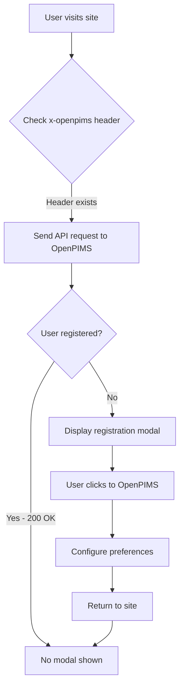

# OpenPIMS WordPress Plugin

[](https://wordpress.org/)
[](https://php.net/)
[](https://www.gnu.org/licenses/gpl-2.0.html)
[](https://github.com/portalix/wordpress)

A WordPress plugin that integrates with the OpenPIMS external privacy management service to provide centralized cookie consent and GDPR compliance across multiple websites.

## 🎯 Overview

OpenPIMS WordPress Plugin enables websites to integrate with the [OpenPIMS service](https://openpims.de/) for managing user privacy preferences and cookie consent. Users configure their privacy settings once on the OpenPIMS platform, and these preferences apply across all participating websites.

## ✨ Features

- 🔒 **External Privacy Management** - Integration with OpenPIMS.de service
- 🍪 **Cookie Consent Management** - Configurable cookie categories (necessary, marketing, functional, analytics)
- 🚀 **Lightweight Implementation** - No database dependencies, minimal performance impact
- 🔍 **HTTP Header Detection** - Uses `x-openpims` headers for user registration status
- 🌍 **Internationalization Ready** - i18n support with text domain `openpims`
- 🛡️ **Security First** - Follows WordPress security best practices
- ⚙️ **Zero Configuration** - Works out of the box with sensible defaults
- 📱 **Responsive Modal** - Mobile-friendly privacy consent interface

## 📋 Requirements

- WordPress 4.0 or higher
- PHP 7.0 or higher
- SSL certificate (HTTPS) recommended for API communication

## 🚀 Installation

### From GitHub

1. Clone or download this repository:
```bash
git clone https://github.com/portalix/wordpress.git openpims
```

2. Upload to your WordPress plugins directory:
```bash
mv openpims /path/to/wordpress/wp-content/plugins/
```

3. Activate the plugin through the WordPress admin panel:
   - Navigate to **Plugins** → **Installed Plugins**
   - Find **OpenPIMS** and click **Activate**

### From WordPress Admin

1. Download the latest release as a ZIP file
2. Go to **Plugins** → **Add New** → **Upload Plugin**
3. Choose the ZIP file and click **Install Now**
4. Activate the plugin after installation

## ⚙️ Configuration

### Default Configuration

The plugin works automatically after activation with no required configuration. It will:
- Detect your site's URL
- Check for user registration with OpenPIMS
- Display modal to unregistered users

### Custom Cookie Categories

Edit the `openpims.json` file to define your cookie categories and vendors:

```json
{
  "categories": {
    "necessary": {
      "id": "necessary",
      "label": "Necessary",
      "description": "Required cookies for basic site functionality"
    },
    "marketing": {
      "id": "marketing",
      "label": "Marketing",
      "description": "Marketing and advertising cookies",
      "vendors": [
        {
          "name": "Facebook",
          "privacy_policy": "https://www.facebook.com/privacy/explanation"
        }
      ]
    }
  }
}
```

## 🔧 How It Works

### Technical Flow



### Plugin Architecture

- **Singleton Pattern** - Ensures single instance via `OpenPIMS::get_instance()`
- **WordPress Hooks** - Integrates with core WordPress lifecycle
- **API Communication** - Uses `wp_remote_get()` for HTTP requests
- **Asset Management** - Proper enqueueing with `wp_localize_script()`
- **Security** - Input sanitization and output escaping

### Key Files

| File | Purpose |
|------|---------|
| `openpims.php` | Main plugin file with core logic |
| `openpims.json` | Cookie category configuration |
| `assets/js/openpims-modal.js` | Modal interaction JavaScript |
| `assets/css/openpims-modal.css` | Modal styling |

## 🔌 WordPress Hooks

The plugin uses these WordPress hooks:

- `plugins_loaded` - Initialize plugin
- `wp_enqueue_scripts` - Load frontend assets
- `wp_footer` - Insert modal HTML
- `admin_menu` - Register settings page
- `register_activation_hook` - Setup on activation
- `register_deactivation_hook` - Cleanup on deactivation

## 🧪 Development

### Local Setup

1. Set up a local WordPress development environment
2. Clone this repository into `wp-content/plugins/`
3. Activate the plugin in WordPress admin

### Code Standards

This plugin follows:
- [WordPress Coding Standards](https://developer.wordpress.org/coding-standards/wordpress-coding-standards/)
- PSR-12 for PHP code style
- Proper escaping for all output
- Nonce verification for forms

### Testing Modal Display

To test the modal display:
1. Clear browser cookies
2. Remove `x-openpims` header if present
3. Visit the site - modal should appear
4. Register on OpenPIMS
5. Return to site - modal should not appear

## 📝 API Endpoints

The plugin communicates with:
- **OpenPIMS Service**: `https://openpims.de/`
- **Configuration Check**: Sends site's `openpims.json` URL

## 🤝 Contributing

Contributions are welcome! Please:

1. Fork the repository
2. Create a feature branch (`git checkout -b feature/YourFeature`)
3. Commit your changes (`git commit -m 'Add YourFeature'`)
4. Push to the branch (`git push origin feature/YourFeature`)
5. Open a Pull Request

### Contribution Guidelines

- Follow WordPress coding standards
- Add proper documentation for new features
- Test changes in multiple WordPress versions
- Update the changelog in readme.txt

## 📄 License

This project is licensed under the GPLv2 or later - see the [LICENSE](LICENSE) file for details.

**Note**: There is currently a license inconsistency - the LICENSE file shows Apache 2.0 while the plugin header indicates GPLv2. This should be resolved in a future update.

## 🐛 Known Issues

- Version mismatch between plugin file (0.1.0) and some documentation
- License inconsistency (GPLv2 vs Apache 2.0)
- Admin settings page exists but has no functional settings yet
- Modal text currently in German only (i18n ready for translations)

## 📞 Support

- **Plugin Homepage**: [https://openpims.de/](https://openpims.de/)
- **Issues**: [GitHub Issues](https://github.com/portalix/wordpress/issues)
- **WordPress Plugin Directory**: (Coming soon)

## 👤 Author

**Portalix**
- GitHub: [@portalix](https://github.com/portalix)

## 🙏 Acknowledgments

- OpenPIMS service for privacy management infrastructure
- WordPress community for development resources
- Contributors and testers

## 📈 Roadmap

- [ ] Add multilingual support for modal text
- [ ] Implement functional admin settings page
- [ ] Add customizable modal styling options
- [ ] Create shortcode for manual modal trigger
- [ ] Add support for custom cookie categories
- [ ] Implement caching for API responses
- [ ] Add debug mode for troubleshooting
- [ ] WordPress.org plugin directory submission

---

Made with ❤️ for privacy-conscious WordPress sites